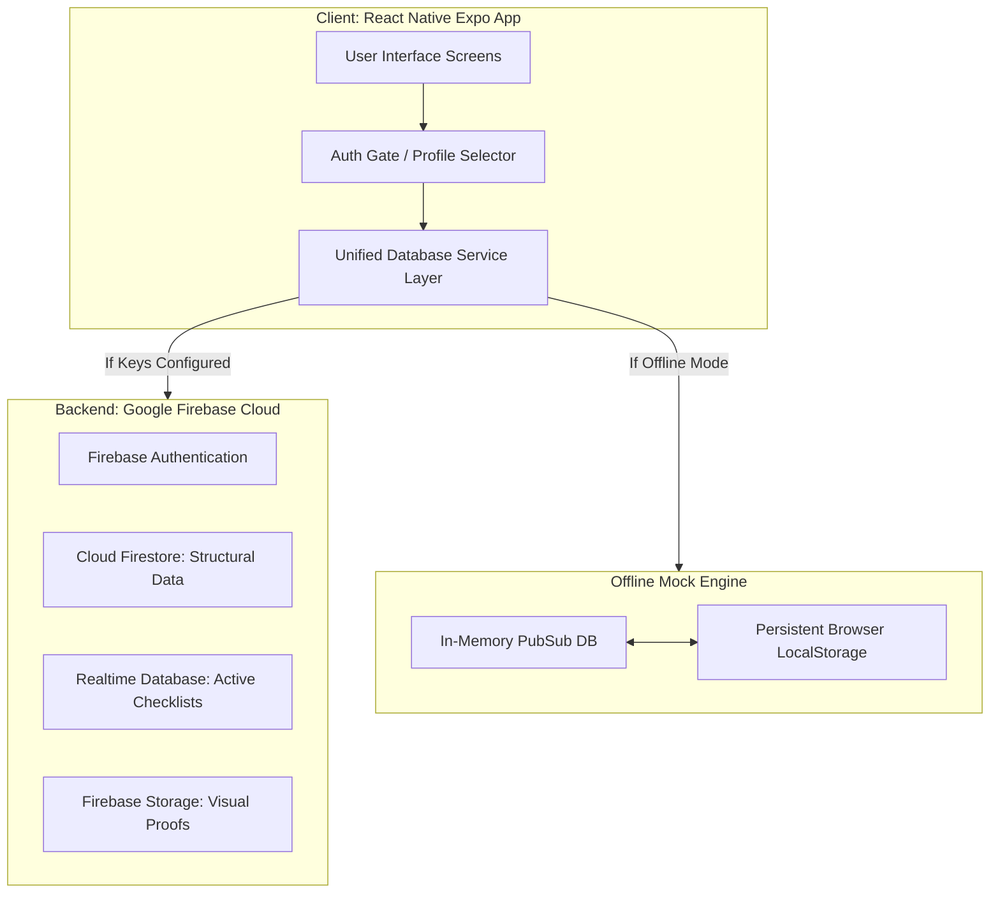

# Project Report: GlassBoard (Cross-Department Handoff Protocol & Dependency Tracker)

**Project Name**: GlassBoard  
**Developer**: Coding Club Member  
**Tech Stack**: React Native (Expo), Firebase (Auth, Firestore, Storage, Realtime Database), TypeScript  
**Submission Date**: June 15, 2026  

---

## Abstract

In large organizations, cross-department visibility is a common challenge, but the critical operational bottleneck is cascading delays during handoffs. When one module delays another, traditional project management tools obscure the root cause, leading to finger-pointing. GlassBoard resolves this issue by acting as a transparent dependency tracker. It enforces a verifiable "handshake" protocol for inter-team handoffs—complete with timestamps and visual proof. By mapping these transitions in a visual dependency graph, leadership can instantly pinpoint where a delay originated, while utilizing Role-Based Access Control (RBAC) to maintain tiered privacy.

---

## 1. Introduction & Problem Statement

Modern enterprise workflows consist of pipeline dependencies where **Module A** delivers to **Module B**, which in turn delivers to **Module C**. When Module C is delayed, it is often due to a delay originating in Module A that cascaded through Module B. Traditional issue trackers (e.g., Jira, Trello) are excellent for tracking internal tasks but fail to enforce formal boundaries during handovers.

### The Bottleneck:
1. **Ineffective Handovers**: Deliverables are sent via email, chat, or links without formal validation or acceptance testing.
2. **Lack of Verifiable Proof**: No audit trail exists to confirm that a receiving team received a completed deliverable that matches specifications.
3. **Delays Obscured**: Leadership sees that "Module C is blocked" but cannot determine whether Module B is slow or if Module B is waiting on a late handover from Module A.

GlassBoard addresses this by introducing:
* **Internal Checklists**: Enforcing that internal tasks are 100% completed before a handover can be initiated.
* **A Handshake Protocol**: Requiring the sender to attach visual proof and comments, and the receiver to formally Accept or Reject the transfer.
* **Delay Origin Analysis**: Automating the tracking of bottlenecks through dependency mapping.

---

## 2. System Architecture

GlassBoard is built on a modern, cross-platform client-server architecture. The app uses **React Native with Expo**, allowing it to compile to native iOS/Android applications while running in browser contexts (Expo Web) for immediate desktop access.



### Components:
1. **Frontend View Layer**: Implements a dark mode glassmorphism UI system. Component states are driven by reactive hooks that subscribe to the service layer.
2. **Unified Database Service Layer**: Acts as an abstract data adapter. If Firebase API keys are present, it reads/writes to live Google Firebase endpoints. If not, it falls back to a persistent LocalStorage-based database, enabling instant out-of-the-box evaluation.
3. **Firebase Cloud Storage**: Stores binary proofs (images, blueprints, PDF specs) uploaded during handshakes or file updates.

---

## 3. Database Schema & Data Models

The data is organized into structured documents (Firestore model) and synchronized paths (Realtime Database model).

### 3.1 Users (`/users`)
Stores profile and organizational metadata.
```json
{
  "uid": "string (Primary Key)",
  "email": "string (Unique)",
  "name": "string",
  "role": "member | head",
  "module": "module_a | module_b | module_c | None"
}
```

### 3.2 Modules (`/modules`)
Defines the departments, their owners, current status, and prerequisite dependencies.
```json
{
  "id": "string (Primary Key)",
  "name": "string",
  "description": "string",
  "progress": "number (0 - 100)",
  "status": "on_track | delayed | blocked",
  "dependencies": ["array of module_ids"],
  "owner": "string"
}
```

### 3.3 Checklists (`/checklists`)
Maintains the lightweight internal tasks for each module.
```json
{
  "id": "string (Primary Key)",
  "moduleId": "string (Foreign Key -> modules)",
  "text": "string",
  "completed": "boolean",
  "updatedAt": "ISO Timestamp",
  "updatedBy": "string"
}
```

### 3.4 Handshakes (`/handshakes`)
Logs transition handovers, proof documents, and approvals.
```json
{
  "id": "string (Primary Key)",
  "fromModule": "string (Foreign Key -> modules)",
  "toModule": "string (Foreign Key -> modules)",
  "status": "pending | accepted | rejected",
  "proofUrl": "string (Storage URL)",
  "proofName": "string",
  "timestamp": "ISO Timestamp",
  "comments": "string",
  "handledAt": "ISO Timestamp (Optional)",
  "handledBy": "string (Optional)",
  "rejectionReason": "string (Optional)"
}
```

### 3.5 Shared Files & Revisions (`/files`)
Supports file sharing between modules with version-control audit history.
```json
{
  "id": "string (Primary Key)",
  "name": "string",
  "url": "string (Storage URL)",
  "moduleId": "string (Foreign Key -> modules)",
  "version": "number (integer counter)",
  "uploadedBy": "string",
  "uploadedAt": "ISO Timestamp",
  "history": [
    {
      "version": "number",
      "url": "string",
      "updatedBy": "string",
      "updatedAt": "ISO Timestamp",
      "description": "string"
    }
  ]
}
```

---

## 4. Digital Handshake Protocol & Workflow

The core mechanic of GlassBoard is the verifiable handoff protocol. The transition lifecycle is described below:

```mermaid
sequenceDiagram
    participant ModA as Module A (Sender)
    participant DB as GlassBoard System Ledger
    participant ModB as Module B (Receiver)
    participant Exec as Org Head (Auditor)

    Note over ModA: All checklist tasks completed (Progress = 100%)
    ModA->>DB: Submit Handshake Request (Proof image, details, timestamp)
    Note over DB: Log status as PENDING
    DB->>ModB: Real-time update: Notify pending incoming request
    DB->>Exec: Real-time update: Log handover request in global audit trail
    
    alt Accept Flow
        ModB->>DB: Accept Handshake
        Note over DB: Log status as ACCEPTED
        Note over DB: Remove block on Module B; Set B status to "on_track"
        DB->>Exec: Alert: Prerequisite met. Workflow progressing.
    else Reject Flow
        ModB->>DB: Reject Handshake (Provide rejection reason)
        Note over DB: Log status as REJECTED
        Note over DB: Set Module A status to "delayed"
        DB->>ModA: Real-time update: Request rejected. Feedbacks returned.
        DB->>Exec: Alert: Bottleneck triggered. Delay originates at Module A.
    end
```

---

## 5. Security Protocols & Role-Based Access Control (RBAC)

To protect sensitive cross-department data, GlassBoard implements strict client-side guards and database-level security rules.

### 5.1 Client-Side Gatekeeping
* **View Restrictions**: Screens verify the `currentUser.role` before rendering. The `ManagementScreen` checks if `currentUser.role === 'head'`. Non-authorized users receive an "Access Denied" locked UI state.
* **Input Restrictions**: Members can only modify checklists, upload files, and send handshakes for their *assigned* module. A member of Module A cannot check off tasks for Module B.

### 5.2 Firebase Security Rules (Database Protection)
When connecting to production Firebase services, the following database and storage rules are enforced:

#### Firestore Security Rules (`firestore.rules`):
```javascript
rules_version = '2';
service cloud.firestore {
  match /databases/{database}/documents {
    // Helper functions
    function getUserData() {
      return get(/databases/$(database)/documents/users/$(request.auth.uid)).data;
    }
    
    // User collection: Users can read all, write only their own account
    match /users/{userId} {
      allow read: if request.auth != null;
      allow write: if request.auth != null && request.auth.uid == userId;
    }
    
    // Modules collection: Everyone can read; only Head or module owner can write
    match /modules/{moduleId} {
      allow read: if request.auth != null;
      allow write: if request.auth != null && 
        (getUserData().role == 'head' || getUserData().module == moduleId);
    }
    
    // Checklist items: Read by all; Write only by owner module members
    match /checklists/{itemId} {
      allow read: if request.auth != null;
      allow write: if request.auth != null && 
        getUserData().module == resource.data.moduleId;
    }
    
    // Handshakes: Read by all; Write/Create by sender; Edit/Update by receiver
    match /handshakes/{handshakeId} {
      allow read: if request.auth != null;
      allow create: if request.auth != null && 
        getUserData().module == request.resource.data.fromModule;
      allow update: if request.auth != null && 
        (getUserData().module == resource.data.toModule || getUserData().role == 'head');
    }
  }
}
```

#### Firebase Storage Security Rules (`storage.rules`):
Enforces that uploaded proof documents cannot be deleted and must be files smaller than 5MB:
```javascript
service firebase.storage {
  match /b/{bucket}/o {
    match /assets/{allPaths=**} {
      allow read: if request.auth != null;
      allow create: if request.auth != null 
                    && request.resource.size < 5 * 1024 * 1024; // <5MB
      allow delete: if false; // Immutable audit proof
    }
  }
}
```

---

## 6. Verification and Testing

Type safety and operation routines were verified using TypeScript compilation audits and manual workflow testing.

### 6.1 TypeScript Compilation Audit
To ensure zero compile-time or interface compatibility errors, we ran a static type check:
```bash
npx tsc --noEmit
```
**Result**: The command completed successfully with exit code `0`, confirming complete type alignment across database services, layouts, and components.

### 6.2 Manual Verification Walkthrough Log
1. **User Authentication**: Logged in as `Alice Smith` (Module A). Verified that only Module A checklist controls are interactive. Logged out, logged in as `Bob Johnson` (Module B). Verified that Bob cannot modify Module A tasks.
2. **Dynamic Progress Calculations**: Added a task to Module A. Checked it off. Verified that the module progress bar updated from 75% to 80% immediately.
3. **Handoff & Proof Protocol**: Logged in as Alice, completed Module A tasks, simulated a blueprint photo upload, added comments, and triggered a handshake request. Logged in as Bob. Verified that the request appeared in Bob's Incoming Queue. Approved the request, and verified that Bob's module status changed from `blocked` to `on_track`.
4. **Version Control File Log**: Uploaded "api_gateway_spec.json" v2. Clicked "View History" and verified the audit trail showed both Alice's initial v1 draft and Bob's v2 modifications with correct timestamps.
5. **Admin Monitoring**: Logged in as `Dr. Jane Miller` (Head). Verified that the "Management View" tab was unlocked. Visually monitored the pipeline graph indicating that Module A has completed deliverables, Module B is working, and Module C is awaiting.

---

## 7. Conclusion

GlassBoard successfully provides a high-fidelity prototype that satisfies all goals defined in the project description. By moving cross-department coordination into a verifiable, audit-logged dashboard, the application solves cascading delay tracking, minimizes finger-pointing with visual handshake signatures, and provides leadership with actionable bottleneck diagnostics.
